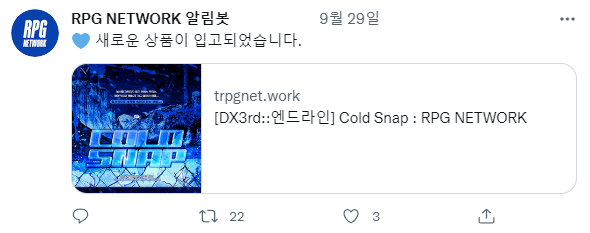

https://trpgnet.work/

해당 사이트에서 새로운 게시글이 올라올 때마다 트위터에 연결된 계정으로 새 글 알림을 작성하는 자동봇입니다.

Twitter에서 제공하는 API인 tweepy를 사용하며, 해당 앱 개발을 위해 Twitter Developer에서 API를 획득한 계정을 사용하였습니다.

사이트의 RSS를 이용해 **requests**를 통해 RSS 데이터를 읽어오고, 해당 데이터를 가공하여 tweepy를 이용해 트윗을 작성합니다.

이때 주소를 통해 게시글의 성질을 분류하여 각각 다른 내용이 트윗으로 작성될 수 있도록 합니다.

▼ 작동 이미지

